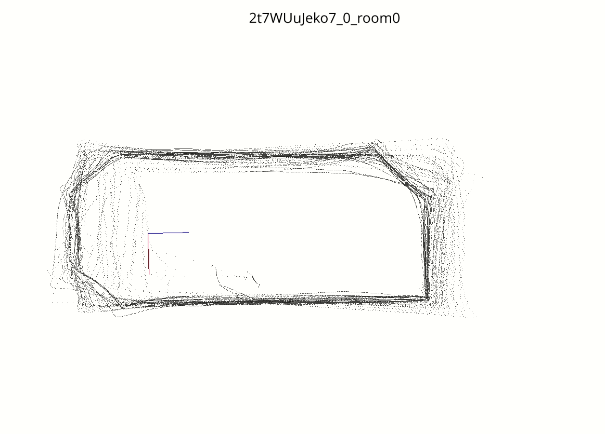

## Comming soon. For more information see [mvl-challege](https://mvlchallenge.github.io/)

The tentative dates for this challenge are described as follows: 
* Warm-up Phase Open - March 20, 2023
* Challenge Phase Open - April 20, 2023
* Challenge Phase Deadline - June 1, 2023
* Winner notification - June 6, 2023

## What can you do with this toolkit?

With the aim of providing support to the participants of the mvl-challenge at the OmniCV workshop during CVPR2023, the present implementation was created as a toolkit that offers the following capabilities:

1. Download the training, testing and pilot datasets used in the challenge. 
2. Load and register the downloaded data as an instance `class Layout`, that simplifies camera and layout projection for you. 
3. Load and retrive multiple `Layout` instances associated to a particular room. 
5. Provide examples of how to evaluate a layout estimation using `Layout` instances. 
6. Provide methods to save, zip and submit layout estimates to evaluation in Eval Ai. 

## Installation

1. Prepare a conda env

```bash
conda create -n mvl-challenge python=3.9
```
2. Clone the `mvl-tookit`:

```bash
git clone https://github.com/mvlchallenge/mvl_toolkit.git
cd mvl_toolkit
git submodule update --init --recursive
```

Note that we have included `HorizonNet` as a submodule. This submodule is intended solely as an out-of-the-box layout estimation example. You will find a non-empty folder named `HorizonNet` located within the `mvl_challenge/models` directory.


3. Install `mvl-toolkit`
```bash
pip install -e .
```

4. Test installation. 
```bash
python  test_toolkit.py
```

## Usage

### 1. Download the dataset
The csv files under `mvl_challenge/data/mp3d_fpe/` specify the ID of each data. We will use these IDs to download the data from Google Drive (zip format) and store them into `{ZIP_DIR}`.

For example:
```bash
# You can change the csv file to download different data
python mvl_challenge/remote_data/download_mvl_data.py -o {ZIP_DIR} -f mvl_challenge/data/mp3d_fpe/test__google_ids__mvl_data.csv
```
See `python mvl_challenge/remote_data/download_mvl_data.py -h` for more detail.

Next, we will unzip the data:
```bash
bash mvl_challenge/remote_data/unzip_data.sh -d {ZIP_DIR} -o {MVL_DATA_DIR}
```
`{MVL_DATA_DIR}` is the final dataset directory storing all the data we will use in this challenge.

The expected structure:   

| - {MVL_DATA_DIR}/  
&emsp;| - geometry_info/  
&emsp;| - img/  
&emsp;| - labels/  

In all the sub-directory above, the data (file name) is in `{scene}_{version}_{room}_{frame}` format, for example, `E9uDoFAP3SH_1_room0_982`. And we call this `MVL_DATA_FORMAT`. 

### 2. Load data
`mvl_challenge/data/mp3d_fpe/{split}__{type}__scene_list.json` represent the `scene_list` which lists the data in `MVL_DATA_FORMAT`. For example, `test__gt_labels__scene_list.json` lists all the data of ground truth labels we have in `MVL_DATA_FORMAT`.

**\*Important\***: the `scene_list` will be the key when we want to access different types of the existing data.

Now we can load the data that we just downloaded and visualize them.  
For exmaple:
```bash
# You can change the scene list json file to load different data
python mvl_challenge/mvl_data/load_mvl_dataset.py -d {MVL_DATA_DIR} -f mvl_challenge/data/mp3d_fpe/test__gt_labels__scene_list.json
```

See `python mvl_challenge/mvl_data/load_mvl_dataset.py -h` for more detail.

While running the program, you should see a sequence of panorama images (i.e., the dataset images) showing up on the screen.


### 3. Make prediction
Now we can load the data and predict the layout by the pre-trained model of HorizonNet.
```bash
python mvl_challenge/mvl_data/load_and_eval_mvl_dataset.py -d {MVL_DATA_DIR} -f mvl_challenge/data/mp3d_fpe/test__mp3d_fpe__scene_list.json
```

See `mvl_challenge/mvl_data/load_and_eval_mvl_dataset.py -h` for more detail.

While running the program, you should see a sequence of panorama images with the layout prediction predicted by HorizonNet showing up on the screen.


In the end, it will pop out a window showing the point cloud of all the layout estimation in 3D.



### 4. Save prediction

In this part, we can further save the prediction result into npz files. Each image frame will have a correspinding npz file containing the layout estimation output. These npz files will be stored in `{RESULTS_DIR}`.

```bash
python mvl_challenge/challenge_results/create_npz_files.py -d {MVL_DATA_DIR} -f mvl_challenge/data/mp3d_fpe/pilot_split__mp3d_fpe__scene_list.json -o {RESULTS_DIR}
```

See `python mvl_challenge/challenge_results/create_npz_files.py -h` for more detail.

Next, we are going to zip all the prediction npz files.

```bash
python mvl_challenge/challenge_results/create_zip_results.py -d {RESULTS_DIR} -f mvl_challenge/data/mp3d_fpe/pilot_split__mp3d_fpe__scene_list.json
```

The resulting zip file is the only file that will be submmitted to the EvalAI server.

## Submission

We recommend you to submmit the file using CLI.

```bash
# Install evalai-cli
pip install evalai
```
```bash
# Add your EvalAI account token to evalai-cli
# You can get {YOUR_TOKEN} on EvalAI
evalai set_token {YOUR_TOKEN}
```
```bash
# Submit the file
# Take warmup phase for example
evalai challenge 1906 phase 3801 submit --file {RESULTS_ZIP_FILE} --large
```

You can find more detail (e.g., changing the phase) on EvalAI website.

### Check evaluation result

We provide a `pilot split` to let you double check if the evaluation result in your local computer agrees with the one on EvalAI.

```bash
python mvl_challenge/challenge_results/evaluate_results.py -d {MVL_DATA_DIR} -f mvl_challenge/data/mp3d_fpe/pilot_split__mp3d_fpe__scene_list.json -o {PILOT_EVAL_DIR}
```

P.S. this can be done because we release 1% of the ground truth labels in `pilot split`.
